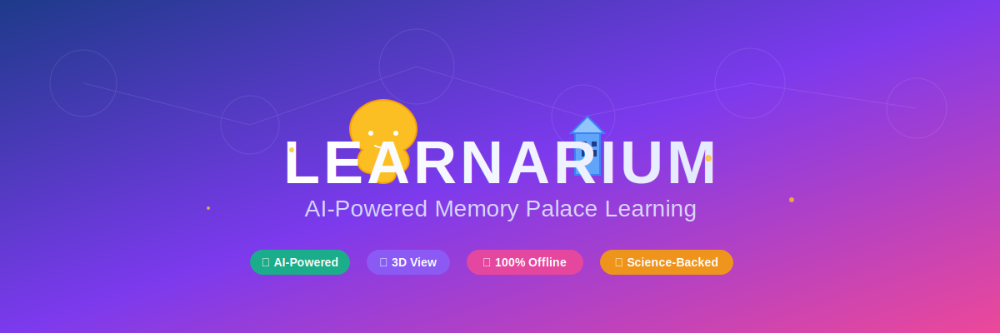

# Learnarium

<div align="center">
  
</div>

<br/>

<div align="center">

**AI-Powered Memory Palace Learning Platform**

Transform your learning with the ancient Method of Loci (Memory Palace technique) enhanced by modern AI. Learnarium helps you create personalized 3D memory palaces from familiar spaces and maps learning content to memorable visual associations.


</div>

---

## Features

- **AI Palace Generation** - Describe any familiar space and AI generates a structured memory palace
- **Smart Concept Mapping** - AI extracts key concepts from learning material and creates memorable associations
- **Interactive 3D Visualization** - Explore your memory palace in immersive 3D with React Three Fiber
- **Multiple AI Providers** - Support for Groq, Google Gemini, and Ollama (100% local & offline)
- **Modern UI** - Beautiful, responsive interface built with Shadcn/ui and Framer Motion
- **Science-Backed** - Based on the Method of Loci, proven effective for thousands of years

## Demo

1. **Describe Your Space** - Tell the AI about your home, office, or any familiar place
2. **Review Your Palace** - See AI-generated rooms and objects from your description
3. **Map Concepts** - Paste learning content and watch AI create memorable associations
4. **Explore in 3D** - Navigate your memory palace with interactive 3D visualization

## Tech Stack

### Frontend
- **Next.js 15.5** - React framework with App Router
- **React 19** - UI library
- **TypeScript** - Type safety
- **Tailwind CSS** - Utility-first styling
- **Shadcn/ui** - Beautiful component library
- **Framer Motion** - Smooth animations
- **React Three Fiber** - 3D visualization with Three.js

### AI & Backend
- **LangChain** - AI orchestration framework
- **Groq** - Fast LLM inference (cloud)
- **Google Gemini** - Alternative AI provider (cloud)
- **Ollama** - Local AI models (100% offline support)
- **Next.js API Routes** - Server-side AI processing

### Testing
- **Jest** - Unit testing framework
- **React Testing Library** - Component testing
- **Playwright** - End-to-end testing

## Getting Started

### Prerequisites

- Node.js 18+ and npm
- (Optional) Ollama installed for local AI

### Installation

```bash
# Clone the repository
git clone https://github.com/albertoelopez/Learnarium.git
cd Learnarium

# Install dependencies
npm install
```

### Configuration

Create a `.env.local` file in the root directory:

```bash
# Choose AI provider: groq, gemini, or ollama
AI_PROVIDER=ollama

# Groq API Key (if using groq)
GROQ_API_KEY=your_groq_api_key

# Google API Key (if using gemini)
GOOGLE_API_KEY=your_google_api_key

# Ollama Configuration (if using ollama)
OLLAMA_BASE_URL=http://localhost:11434
OLLAMA_MODEL=gpt-oss
```

### Running the App

```bash
# Development server
npm run dev

# Production build
npm run build
npm start
```

Open [http://localhost:3000](http://localhost:3000) to use the app.

## AI Provider Setup

### Option 1: Groq (Cloud - Fast)
1. Sign up at [groq.com](https://groq.com)
2. Get your API key
3. Set `AI_PROVIDER=groq` and `GROQ_API_KEY=your_key`

### Option 2: Google Gemini (Cloud)
1. Get API key from [Google AI Studio](https://makersuite.google.com/app/apikey)
2. Set `AI_PROVIDER=gemini` and `GOOGLE_API_KEY=your_key`

### Option 3: Ollama (Local - 100% Offline)
1. Install [Ollama](https://ollama.ai)
2. Pull a model: `ollama pull llama2`
3. Set `AI_PROVIDER=ollama` and `OLLAMA_MODEL=llama2`

## Testing

Learnarium has comprehensive test coverage with 40 unit tests and E2E tests.

```bash
# Run all unit tests
npm test

# Run tests with coverage report
npm test -- --coverage

# Run E2E tests
npm run test:e2e

# Test Ollama connection
node scripts/test-ollama.js
```

**Test Results:** 43 passing tests, 95.7% code coverage

For detailed test documentation, see [docs/TESTING.md](docs/TESTING.md)

## Project Structure

```
learnarium/
├── src/
│   ├── app/                    # Next.js App Router
│   │   ├── api/               # API routes for AI processing
│   │   ├── globals.css        # Global styles & theme
│   │   └── page.tsx           # Main application page
│   ├── components/            # React components
│   │   ├── ui/               # Shadcn UI components
│   │   ├── PalaceCreator.tsx # Step 1: AI palace generation
│   │   ├── PalaceEditor.tsx  # Step 2: Review palace
│   │   ├── ConceptMapper.tsx # Step 3: Map learning content
│   │   ├── PalaceViewer.tsx  # Step 4: 3D visualization wrapper
│   │   └── Palace3D.tsx      # Three.js 3D scene
│   ├── chains/               # LangChain AI chains
│   ├── lib/                  # Utilities
│   ├── types/                # TypeScript types
│   └── __tests__/            # Test files
├── scripts/                   # Utility scripts
├── playwright.config.ts      # E2E test configuration
├── jest.config.js           # Unit test configuration
└── tailwind.config.ts       # Tailwind CSS configuration
```

## How It Works

### The Method of Loci

The Method of Loci (Memory Palace technique) is an ancient mnemonic device:

1. **Spatial Memory** - Humans are excellent at remembering spaces
2. **Visual Association** - Link abstract concepts to concrete objects
3. **Mental Journey** - Navigate through your palace to recall information

### AI Enhancement

Learnarium automates memory palace creation:

1. **Palace Generation** - AI parses your space description and creates structured rooms with objects
2. **Concept Extraction** - AI identifies key learning points from your content
3. **Mnemonic Creation** - AI generates memorable visual associations between concepts and objects
4. **3D Visualization** - Interactive 3D space reinforces spatial memory

## API Endpoints

### POST /api/generate-palace
Generates a memory palace from a space description.

**Request:**
```json
{
  "description": "My apartment has a living room with a red couch..."
}
```

**Response:**
```json
{
  "id": "palace-uuid",
  "name": "My Apartment Palace",
  "rooms": [...],
  "objects": [...]
}
```

### POST /api/map-concepts
Maps learning content to palace objects.

**Request:**
```json
{
  "learningText": "Python is a programming language...",
  "palace": { ... }
}
```

**Response:**
```json
{
  "mappings": [
    {
      "conceptText": "Python is interpreted",
      "objectId": "object-uuid",
      "mnemonicHint": "Imagine a python snake..."
    }
  ]
}
```

## Roadmap

### Phase 1 (MVP) ✅
- Palace template schema
- AI palace generation (multi-provider)
- AI concept mapping with mnemonics
- 3D visualization with Three.js
- Modern UI with Tailwind + Shadcn
- Ollama support for offline operation
- Comprehensive test coverage

### Phase 2
- Spaced repetition system
- Palace persistence (save/load)
- Import/export palaces
- Enhanced 3D environments
- Multiple learning modes

### Phase 3
- VR/MR support (Quest 3)
- Immersive walkthrough
- Voice navigation
- Gesture controls

### Phase 4
- Multi-user platform
- Palace sharing & marketplace
- Collaborative learning spaces
- B2B educational features

## Contributing

Contributions are welcome! Please feel free to submit a Pull Request.

## License

MIT License - see LICENSE file for details

## Acknowledgments

- Built with [Next.js](https://nextjs.org/)
- UI components from [Shadcn/ui](https://ui.shadcn.com/)
- 3D rendering with [React Three Fiber](https://docs.pmnd.rs/react-three-fiber)
- AI orchestration by [LangChain](https://js.langchain.com/)
- Inspired by ancient memory techniques and modern cognitive science

## Support

For issues, questions, or suggestions, please open an issue on GitHub.

---

**Made with** ⚡ **by the Learnarium Team**
